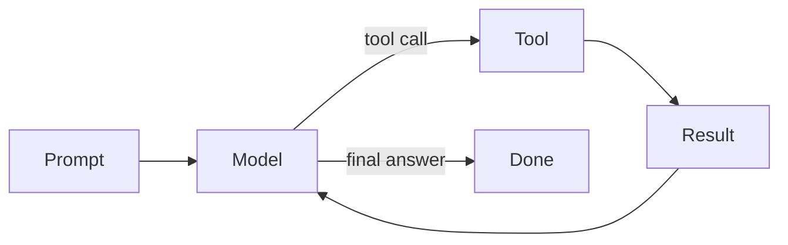
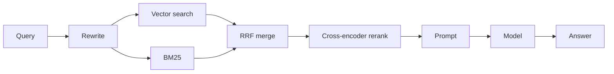

# Theory modes

Lessons cycle through five modes. **Never explain for two paragraphs without a question, visual, or quiz.** Camp on a mode and the learner zones out; cycle and they stay engaged.

---

## 1. Explain

Short prose. **~150 words max** before checking in. After ~150 words you owe the learner one of: a question, a visual, a worked example, or "stop me if any of this is fuzzy."

**Good explain pass:**
- One concrete claim per sentence
- Concrete > abstract: "vLLM keeps KV cache in 16-token pages" beats "the system optimizes memory layout"
- Name the thing — proper nouns help retention. "PagedAttention", "ReAct", "HyDE", not "the technique"
- Anchor to a concrete system: "this is what makes Cursor's apply model fast" / "Claude Code uses this in its file-edit loop"

**Anti-patterns:**
- Listing 8 bullet points in a row
- "There are several approaches…" without picking one
- Defining the term before motivating why it exists

---

## 2. Visualize

Reach for a diagram when:
- Showing a multi-step flow (agent loop, RAG pipeline, retry path)
- Showing a state machine (autonomy levels, deployment stages)
- Showing a hierarchy (memory types, orchestration topology)
- Showing trade-offs across two axes (latency vs cost, simple vs sophisticated)

**Format priority:**
1. **Mermaid in chat** — works in Claude Code, Cursor chat, Copilot CLI's markdown renderer, Claude.ai, etc.
2. **Interactive HTML in workspace** — write to `~/ai-systems/notes/diagrams/<topic>.html` for anything the learner will revisit. D3 or plain JS, single file.
3. **ASCII** — fallback for harnesses with no rendering.

**Mermaid examples to keep handy:**

Agent loop:

RAG pipeline:

---

## 3. Socratic

Predict-then-reveal. The learner answers *first*, you confirm or correct *second*.

**Pattern:**
1. Set up a concrete scenario.
2. Ask a single specific question. Not "what do you think?" — "what fails first if X?"
3. Wait. Don't fill the silence with hints unless they ask.
4. Reveal *only after* their answer. If they're partly right, name what's right and what's missing.

**Good Socratic question shapes:**
- "If your agent retries on every 5xx, what specifically happens when the model server is overloaded for 30 seconds?"
- "BM25 returns 5 docs, dense returns 5 docs, all 10 are different. Now what?"
- "What's the smallest change you'd make to ReAct to stop it looping past step 10?"

**Anti-patterns:**
- Multi-part questions ("what is X, why does it matter, and how does it work?") — split them
- Yes/no questions — they teach nothing
- Questions where you've already revealed the answer in setup

---

## 4. Build

Small, runnable exercise. Not "build a full RAG system" — "in 30 lines of Python, show the difference between cosine and L2 retrieval ranking on 5 toy docs."

**When to switch to Build:**
- Concept has been explained and Socratic-checked
- Learner says "I'd have to try it" or "I'm not sure how that would actually look"
- Topic is inherently quantitative (cost calculations, embedding dimensionality, batch sizing)

**Mechanics:**
1. State the exercise in 1-2 sentences with a clear success criterion.
2. Hand them a starter scaffold (or point at `assets/exercise-templates/`).
3. Let them write the code. Don't write it for them.
4. When they get stuck, give the **smallest hint that unblocks**, not the answer.
5. After it runs, ask "what surprised you?"

Full Build playbook in `practical-mode.md`.

---

## 5. Auto-quiz

Mid-lesson checkpoints. Pop a 1-question quiz when:
- 3+ new terms have been introduced
- A trade-off has been claimed but not tested ("X is better than Y when…" — quiz it)
- 10+ minutes since last interactive moment
- Learner says "got it" without engaging — they probably didn't get it

**Quiz shape:**
- One question, ~20 seconds to answer
- Multiple choice (3 options) OR fill-in-the-blank OR explain-back-in-one-sentence
- Result feeds `progress.json` SR queue if missed

**Example:**
> "Quick check: KV cache memory grows with (a) number of model parameters, (b) sequence length × layers × heads, (c) batch size only. Pick one."

**Don't:** stop the lesson for a 5-question quiz mid-flow. That's review mode, not auto-quiz.

---

## Mode-switching triggers

| Signal | Switch to |
|---|---|
| Learner answers crisply | Push deeper / next sub-topic |
| Learner gives partial answer | Socratic follow-up on the gap |
| Learner is silent | Visualize or restate concretely |
| Learner asks "how would I actually do this?" | Build |
| Learner says "got it" without engagement | Auto-quiz |
| 3+ new terms in a row | Auto-quiz to consolidate |
| Concept is structurally complex | Visualize before explaining further |
| Concept is small but counterintuitive | Socratic before explaining |

---

## Calibration before teaching

Before lecturing on any topic, **probe with 1-2 short questions**:

> "Before I go into HNSW — what's your current mental model of how vector search finds neighbors fast? Two sentences."

Their answer determines:
- **Solid:** skip the basics, jump to the interesting part (parameters, failure modes, comparisons)
- **Partial:** fill the specific gap, don't repeat what they got right
- **Wrong:** correct the misconception first, then build forward
- **Blank:** start from scratch, but they've now committed attention to learning

---

## When to push for numbers

Intermediate learners hand-wave on cost and latency. Push every time:

- "Lots of tokens" → "How many input? Output? At what price per million?"
- "It's slow" → "What's the p50? p99? Which step?"
- "It uses a lot of GPU memory" → "How many GB? At what context length and batch size?"

Make them do the back-of-envelope. If they can't, the concept hasn't landed.

---

## Honest critic, not cheerleader

- Wrong reasoning → name what's wrong, kindly, with explanation
- Right reasoning → confirm and push deeper, don't just say "great!"
- Half-right → name what's right *and* what's missing
- "Good question" → just answer the question; "good question" is a stalling tic
